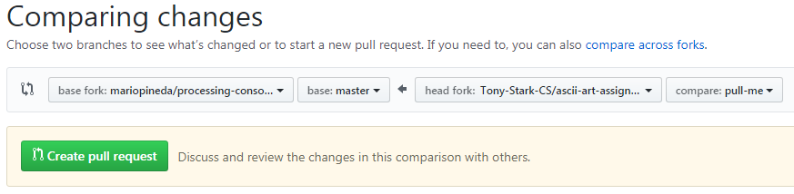

# Submitting marking a request
_Important: Assignments not submitted **exactly** according to the instructions will not be marked._

Submitt marking requests by following these instructions:
1. Go to your assignment repository at GitHub. 
2. Click the Issues tab in the assignment repository. If the tab is missing, go to the Settings tab and enable Issues.
3. Click the green New issue button.
4. Submitt a marking request by entering the following text in the title field: ```Marking Request (Your First Name)```, replacing ```Your First Name``` with..., you actual first name and the following text in the main text field (where it says "Leave a comment"): ```@mariopineda```. For example, if student Tony Stark is submitting a marking request he would complete the form as as follows:

5. Double check that the entered information is correct (_Assignments not submitted **exactly** according to the instructions will not be marked._)
6. Click the green Submitt new issue button.

# Marking Rubric
Category                    | Score        | Comment
----------------------------| -------------| --------
SCM (0-3)                   |              |
Specifications (0-3)        |              |
Code hygiene (0-3)          |              |
Accepted pull request (0-1) |              |
**Total**                   |  /10         


# Submitting a pull request
To obtain the final 10% on your assignment you need to submitt a pull request and it **has to be accepted** by your teacher. In order for a pull request to be accepted 
* you have to have full marks in the previous categories
* it has to be a high quality contribution that will improve the original assignment

To submitt a pull request follow these steps:
1. Go to the forked repos of the assignment for which you wish to submitt a pull request for.
2. In GitHub create a branch of the master called ```pull-me```.
3. In the ```pull-me``` branch remove your code and any solutions to the assigment. You are aiming to create a new (and better) template for the assignment so all solutions have to be removed before it can be considered for a pull request.
4. Click on the Pull request tab.
5. Click on the green New pull request button
6. Choose the master branch of the assignment in the original template repository for @mariopineda against the pull-me branch in your assignment repository. See image for an example. 

7. Click green Create pull request button
8. Fill out the pull request form by,
  * putting ```Pull request (Your First Name``` in the title field, 
  * tag @mariopineda on the first line in the text box,
  * provide a one sentence explanation for why your version of the assignment is an improvement over the original (do not provide the details of your improvements here, just explain why your version is an improvement), and
  * a bulleted list detailing the exact changes you did (not why you did them, but what you did).
  

# Keeping up to date with the master repository 
If yuor teacher makes changes to the instructions for an assignment you may want to update your forked repos against the teacher master repos using the following instructions.

**Step 1:** The first time you are updating your repository you need to run the following command (replace _<name of assignment>_ with the name of the assignment):
```
git remote add upstream https://github.com/mariopineda/<name of assignment>
```
**Step 2:** If you are using the same computer you do not have to do Step 1 in subsequent updates and you can skip right to Step 2. In this step you need to run the following two commands:
```
git fetch upstream
git merge upstream/master
```
**Step 3:** Resolve possible merge conflicts and commit.

**Step 5:** You local repository has now been updated using your teacher's master respository. Finally you need to push your local repository to GitHub to make sure that your GitHub repository is updated as well.
