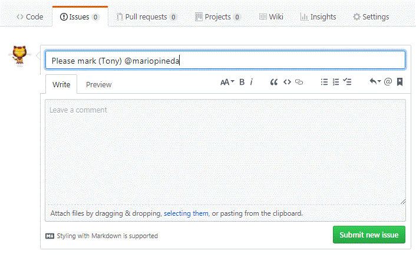

# Handing in completed assignments 
_Important: If your assignment is not submitted *exactly* according to the instructions it will not be marked._

Hand in completed assignment for marking by 
1. Click the Issue tab in the assignment repository. If the issues tab is missing you need to go to the Settings tab and enable Issues first.
2. Click the green New issue
3. Create a new issue by entering the following in the title field (Placing "Tony" with your own first name): 

# Marking Rubric
Category                    | Score        
----------------------------| -------------
SCM (0-3)                   |  
Specifications (0-3)        | 
Code hygiene (0-3)          | 
Accepted pull request (0-1) |
**Total**                   |  /10

Marked on:

Comment:
