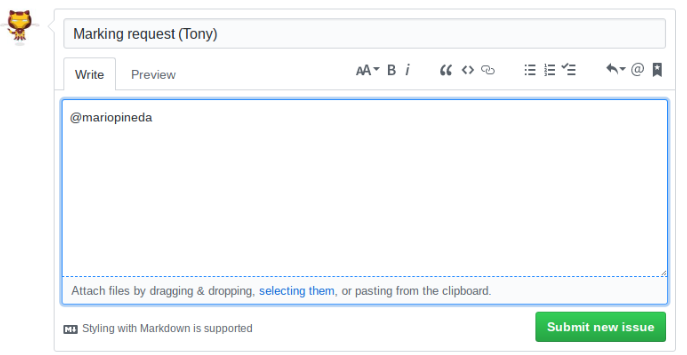

# Handing in completed assignments 
_Important: Assignments not submitted **exactly** according to the instructions will not be marked._

Hand in completed assignment for marking by following these instructions:
1. Click the Issues tab in the assignment repository. If the tab is missing you need to go to the Settings tab and enable Issues first.
2. Click the green New issue button.
3. Submitt a marking request by entering the following text in the title field: ```Marking Request (Your First Name)```, replacing ```Your First Name``` with..., you actual first name and the following text in the main text field (where it says "Leave a comment"): ```@mariopineda```. For example, if student Tony Stark is submitting a marking request he would complete the form as as follows:

4. Double check that the entered information is correct (_Assignments not submitted **exactly** according to the instructions will not be marked._)
5. Click the green Submitt new issue button.

# Marking Rubric
Category                    | Score        
----------------------------| -------------
SCM (0-3)                   |  
Specifications (0-3)        | 
Code hygiene (0-3)          | 
Accepted pull request (0-1) |
**Total**                   |  /10

Marked on:

Comment:
